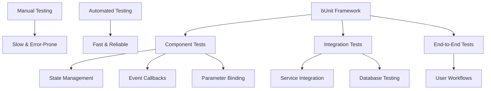

# Blazor Application Testing — Complete Guide

## Overview
This guide provides comprehensive testing strategies for Blazor applications, covering component testing with bUnit, integration testing, and automated testing workflows. You will learn to replace slow manual testing with fast, reliable automated tests that catch UI regressions and business logic errors instantly. The guide covers both Blazor Server and Blazor WebAssembly applications with practical, real-world examples.

After following this guide, you will be able to:
- Set up automated component testing with bUnit
- Test complex component interactions and state management  
- Mock dependencies and external services
- Configure CI/CD pipelines for automated testing
- Debug failing tests efficiently



## Prerequisites

**Required Tools:**
- .NET 8 SDK or later
- Visual Studio 2022, VS Code, or JetBrains Rider
- Git for version control

**Required Packages:**
- `bunit` (>= 1.24.10) - Blazor component testing framework
- `xUnit` (>= 2.4.2) - Testing framework (or NUnit/MSTest)
- `Moq` (>= 4.20.69) - Mocking framework
- `Microsoft.AspNetCore.Components.Testing` for advanced scenarios

**Required Knowledge:**
- C# and .NET fundamentals
- Blazor component architecture (parameters, events, lifecycles)
- Dependency injection basics
- HTML and CSS selectors

**System Requirements:**
- Windows 10+, macOS 10.15+, or Linux
- 8GB RAM minimum for test execution
- 2GB free disk space for test artifacts

## Quick Start

```bash
# 1. Create a new Blazor test project
dotnet new classlib -n YourApp.Tests
cd YourApp.Tests

# 2. Install required packages
dotnet add package bunit --version 1.24.10
dotnet add package xunit --version 2.4.2
dotnet add package xunit.runner.visualstudio --version 2.4.5
dotnet add package Moq --version 4.20.69
dotnet add package Microsoft.NET.Test.Sdk --version 17.8.0

# 3. Add reference to your main Blazor project
dotnet add reference ../YourMainApp/YourMainApp.csproj

# 4. Create first component test
mkdir Components
touch Components/CounterComponentTest.cs

# 5. Run tests
dotnet test
```

## Project Structure

```
YourBlazorApp/
├── src/
│   ├── YourApp.csproj                    # Main Blazor application
│   ├── Components/                       # Blazor components to test
│   │   ├── Counter.razor                 # Example component
│   │   └── WeatherDisplay.razor          # Component with external dependencies
│   ├── Services/                         # Business logic services
│   │   ├── WeatherService.cs             # Service to mock in tests
│   │   └── IWeatherService.cs            # Interface for mocking
│   └── ViewModels/                       # State management (if used)
├── tests/
│   ├── YourApp.Tests.csproj              # Test project file
│   ├── Components/                       # Component tests (YOU MODIFY)
│   │   ├── CounterComponentTest.cs       # Basic component tests
│   │   └── WeatherDisplayTest.cs         # Component tests with mocks
│   ├── Integration/                      # Integration tests (YOU MODIFY)
│   │   └── ComponentInteractionTests.cs # Multi-component workflows
│   ├── ViewModels/                       # ViewModel/state tests (YOU MODIFY)
│   │   └── WeatherViewModelTests.cs     # Business logic tests
│   └── Helpers/                          # Test utilities (YOU CREATE)
│       ├── TestContextExtensions.cs     # bUnit configuration helpers
│       └── MockServiceFactory.cs        # Service mocking utilities
└── blazor-testing-guide.md              # This guide
```

## Core Concepts

### **bUnit TestContext**
**What it is:** The foundation of all bUnit tests, providing a sandboxed environment for rendering components.
**Why it matters:** Isolates component tests from each other and provides service registration, JSInterop mocking, and component rendering.
**Where it lives:** Every test class inherits from `TestContext` or uses it as a dependency.

```csharp
public class MyComponentTest : TestContext
{
    [Fact]
    public void Component_RendersCorrectly()
    {
        // TestContext provides Services, JSInterop, RenderTree access
        var component = RenderComponent<MyComponent>();
        Assert.Contains("Expected text", component.Markup);
    }
}
```

### **Component Parameters**
**What it is:** Mechanism for passing data into components during testing, simulating real usage.
**Why it matters:** Tests must verify components behave correctly with various parameter combinations.
**Where it lives:** `RenderComponent<T>()` parameter builder pattern.

```csharp
var component = RenderComponent<WeatherDisplay>(parameters => parameters
    .Add(p => p.Location, "New York")
    .Add(p => p.ShowDetails, true)
    .Add(p => p.OnLocationChanged, EventCallback.Factory.Create<string>(this, HandleChange)));
```

### **EventCallback Testing**
**What it is:** Verifying that components properly invoke parent callbacks when user interactions occur.
**Why it matters:** Ensures component communication works correctly in component hierarchies.
**Where it lives:** Component interaction tests and integration tests.

```csharp
bool callbackInvoked = false;
var component = RenderComponent<MyComponent>(parameters => parameters
    .Add(p => p.OnClick, EventCallback.Factory.Create(this, () => callbackInvoked = true)));

component.Find("button").Click();
Assert.True(callbackInvoked);
```

### **Service Mocking**
**What it is:** Replacing real dependencies with controlled mock objects during testing.
**Why it matters:** Isolates component logic from external dependencies and enables predictable test scenarios.
**Where it lives:** Test setup in constructors or test methods.

```csharp
public MyComponentTest()
{
    var mockWeather = new Mock<IWeatherService>();
    mockWeather.Setup(x => x.GetWeatherAsync("NYC"))
              .ReturnsAsync(new WeatherData { Temperature = 25 });
    Services.AddSingleton(mockWeather.Object);
}
```

### **JSInterop Mocking**
**What it is:** Mocking JavaScript calls that Blazor components make to browser APIs or external libraries.
**Why it matters:** Many UI libraries (like MudBlazor) require JavaScript initialization that needs to be mocked in tests.
**Where it lives:** Test setup using bUnit's JSInterop property.

```csharp
public MyComponentTest()
{
    // Mock JavaScript functions called by components
    JSInterop.SetupVoid("mudPopover.initialize", _ => true);
    JSInterop.SetupVoid("scrollToElement", _ => true);
    JSInterop.Setup<string>("localStorage.getItem", "theme").SetResult("dark");
}
```

## Step-by-Step Walkthrough

### 1. Basic Component Testing

Start with testing simple components that don't have external dependencies.

**Test File: `tests/Components/CounterTest.cs`**
```csharp
using Bunit;
using Xunit;
using YourApp.Components;

namespace YourApp.Tests.Components;

public class CounterTest : TestContext
{
    [Fact]
    public void Counter_StartsAtZero()
    {
        // Arrange & Act
        var component = RenderComponent<Counter>();
        
        // Assert
        Assert.Contains("Current count: 0", component.Markup);
    }
    
    [Fact]
    public void Counter_IncrementsOnClick()
    {
        // Arrange
        var component = RenderComponent<Counter>();
        
        // Act
        component.Find("button").Click();
        
        // Assert
        Assert.Contains("Current count: 1", component.Markup);
    }
}
```

### 2. Component with Parameters

Test components that receive parameters and verify different behavior based on inputs.

**Component: `src/Components/WeatherDisplay.razor`**
```razor
@if (IsLoading)
{
    <div class="loading">Loading weather...</div>
}
else
{
    <div class="weather-info">
        <h3>Weather in @Location</h3>
        <p>Temperature: @Temperature°C</p>
        @if (ShowDetails)
        {
            <div class="details">
                <p>Humidity: @Humidity%</p>
            </div>
        }
    </div>
}

@code {
    [Parameter] public string Location { get; set; } = "";
    [Parameter] public bool IsLoading { get; set; }
    [Parameter] public bool ShowDetails { get; set; }
    [Parameter] public int Temperature { get; set; }
    [Parameter] public int Humidity { get; set; } = 60;
}
```

**Test File: `tests/Components/WeatherDisplayTest.cs`**
```csharp
namespace YourApp.Tests.Components;

public class WeatherDisplayTest : TestContext
{
    [Fact]
    public void WeatherDisplay_ShowsLoadingState()
    {
        // Arrange & Act
        var component = RenderComponent<WeatherDisplay>(parameters => parameters
            .Add(p => p.IsLoading, true));
        
        // Assert
        Assert.Contains("Loading weather...", component.Markup);
        Assert.DoesNotContain("weather-info", component.Markup);
    }
    
    [Fact]
    public void WeatherDisplay_ShowsWeatherInfo_WhenNotLoading()
    {
        // Arrange & Act
        var component = RenderComponent<WeatherDisplay>(parameters => parameters
            .Add(p => p.Location, "Paris")
            .Add(p => p.Temperature, 22)
            .Add(p => p.IsLoading, false));
        
        // Assert
        Assert.Contains("Weather in Paris", component.Markup);
        Assert.Contains("Temperature: 22°C", component.Markup);
    }
    
    [Fact]
    public void WeatherDisplay_ShowsDetails_WhenShowDetailsTrue()
    {
        // Arrange & Act
        var component = RenderComponent<WeatherDisplay>(parameters => parameters
            .Add(p => p.Location, "London")
            .Add(p => p.Temperature, 18)
            .Add(p => p.Humidity, 75)
            .Add(p => p.ShowDetails, true));
        
        // Assert
        Assert.Contains("details", component.Markup);
        Assert.Contains("Humidity: 75%", component.Markup);
    }
    
    [Fact]
    public void WeatherDisplay_HidesDetails_WhenShowDetailsFalse()
    {
        // Arrange & Act
        var component = RenderComponent<WeatherDisplay>(parameters => parameters
            .Add(p => p.Location, "Tokyo")
            .Add(p => p.ShowDetails, false));
        
        // Assert
        Assert.DoesNotContain("details", component.Markup);
        Assert.DoesNotContain("Humidity:", component.Markup);
    }
}
```

### 3. Testing Components with Dependencies

Test components that use injected services by mocking the dependencies.

**Service Interface: `src/Services/IWeatherService.cs`**
```csharp
public interface IWeatherService
{
    Task<WeatherData> GetWeatherAsync(string location);
    Task<List<string>> GetAvailableLocationsAsync();
}

public class WeatherData
{
    public string Location { get; set; } = "";
    public int Temperature { get; set; }
    public int Humidity { get; set; }
    public string Condition { get; set; } = "";
    public DateTime LastUpdated { get; set; }
}
```

**Component with Service: `src/Components/WeatherWidget.razor`**
```razor
@inject IWeatherService WeatherService

<div class="weather-widget">
    <select @bind="SelectedLocation" @bind:after="LoadWeather">
        @foreach (var location in AvailableLocations)
        {
            <option value="@location">@location</option>
        }
    </select>
    
    @if (IsLoading)
    {
        <div class="spinner">Loading...</div>
    }
    else if (CurrentWeather != null)
    {
        <WeatherDisplay Location="@CurrentWeather.Location"
                       Temperature="@CurrentWeather.Temperature"
                       Humidity="@CurrentWeather.Humidity"
                       ShowDetails="true" />
    }
</div>

@code {
    private List<string> AvailableLocations = new();
    private WeatherData? CurrentWeather;
    private bool IsLoading;
    private string SelectedLocation = "";
    
    protected override async Task OnInitializedAsync()
    {
        AvailableLocations = await WeatherService.GetAvailableLocationsAsync();
        if (AvailableLocations.Count > 0)
        {
            SelectedLocation = AvailableLocations[0];
            await LoadWeather();
        }
    }
    
    private async Task LoadWeather()
    {
        if (string.IsNullOrEmpty(SelectedLocation)) return;
        
        IsLoading = true;
        try
        {
            CurrentWeather = await WeatherService.GetWeatherAsync(SelectedLocation);
        }
        finally
        {
            IsLoading = false;
        }
    }
}
```

**Test File: `tests/Components/WeatherWidgetTest.cs`**
```csharp
using Microsoft.Extensions.DependencyInjection;
using Moq;

namespace YourApp.Tests.Components;

public class WeatherWidgetTest : TestContext
{
    private readonly Mock<IWeatherService> _mockWeatherService;
    
    public WeatherWidgetTest()
    {
        _mockWeatherService = new Mock<IWeatherService>();
        Services.AddSingleton(_mockWeatherService.Object);
    }
    
    [Fact]
    public async Task WeatherWidget_LoadsAvailableLocations_OnInitialization()
    {
        // Arrange
        var locations = new List<string> { "New York", "London", "Tokyo" };
        _mockWeatherService.Setup(x => x.GetAvailableLocationsAsync())
                          .ReturnsAsync(locations);
        _mockWeatherService.Setup(x => x.GetWeatherAsync(It.IsAny<string>()))
                          .ReturnsAsync(new WeatherData { Location = "New York", Temperature = 20 });
        
        // Act
        var component = RenderComponent<WeatherWidget>();
        
        // Assert
        var select = component.Find("select");
        Assert.Contains("New York", select.InnerHtml);
        Assert.Contains("London", select.InnerHtml);
        Assert.Contains("Tokyo", select.InnerHtml);
    }
    
    [Fact]
    public async Task WeatherWidget_ShowsLoadingState_WhileFetching()
    {
        // Arrange
        var locations = new List<string> { "Paris" };
        _mockWeatherService.Setup(x => x.GetAvailableLocationsAsync())
                          .ReturnsAsync(locations);
        _mockWeatherService.Setup(x => x.GetWeatherAsync("Paris"))
                          .Returns(async () => 
                          {
                              await Task.Delay(100); // Simulate slow service
                              return new WeatherData { Location = "Paris", Temperature = 22 };
                          });
        
        // Act
        var component = RenderComponent<WeatherWidget>();
        
        // Assert - Loading should be visible immediately
        Assert.Contains("Loading...", component.Markup);
    }
    
    [Fact]
    public async Task WeatherWidget_ChangesLocation_WhenSelectionChanges()
    {
        // Arrange
        var locations = new List<string> { "New York", "London" };
        _mockWeatherService.Setup(x => x.GetAvailableLocationsAsync())
                          .ReturnsAsync(locations);
        _mockWeatherService.Setup(x => x.GetWeatherAsync("New York"))
                          .ReturnsAsync(new WeatherData { Location = "New York", Temperature = 20 });
        _mockWeatherService.Setup(x => x.GetWeatherAsync("London"))
                          .ReturnsAsync(new WeatherData { Location = "London", Temperature = 15 });
        
        // Act
        var component = RenderComponent<WeatherWidget>();
        var select = component.Find("select");
        
        // Change selection to London
        select.Change("London");
        
        // Assert
        _mockWeatherService.Verify(x => x.GetWeatherAsync("London"), Times.Once);
        
        // Wait for state update and verify display
        await Task.Delay(10);
        component.Render();
        
        Assert.Contains("Weather in London", component.Markup);
        Assert.Contains("Temperature: 15°C", component.Markup);
    }
}
```

### 4. Integration Testing

Test how multiple components work together and verify the overall user workflow.

**Integration Test: `tests/Integration/WeatherWorkflowTest.cs`**
```csharp
namespace YourApp.Tests.Integration;

public class WeatherWorkflowTest : TestContext
{
    private readonly Mock<IWeatherService> _mockWeatherService;
    
    public WeatherWorkflowTest()
    {
        _mockWeatherService = new Mock<IWeatherService>();
        Services.AddSingleton(_mockWeatherService.Object);
        
        // Setup common test data
        var locations = new List<string> { "New York", "London", "Tokyo" };
        _mockWeatherService.Setup(x => x.GetAvailableLocationsAsync())
                          .ReturnsAsync(locations);
    }
    
    [Fact]
    public async Task CompleteWeatherFlow_UserSelectsLocation_SeedsDetails()
    {
        // Arrange
        _mockWeatherService.Setup(x => x.GetWeatherAsync("Tokyo"))
                          .ReturnsAsync(new WeatherData 
                          { 
                              Location = "Tokyo", 
                              Temperature = 28, 
                              Humidity = 65,
                              Condition = "Sunny"
                          });
        
        // Act - User opens the weather widget
        var component = RenderComponent<WeatherWidget>();
        
        // Act - User selects Tokyo from dropdown
        var select = component.Find("select");
        select.Change("Tokyo");
        
        // Wait for async operations to complete
        await Task.Delay(50);
        component.Render();
        
        // Assert - Verify complete weather information is displayed
        Assert.Contains("Weather in Tokyo", component.Markup);
        Assert.Contains("Temperature: 28°C", component.Markup);
        Assert.Contains("Humidity: 65%", component.Markup);
        
        // Assert - Verify service was called correctly
        _mockWeatherService.Verify(x => x.GetWeatherAsync("Tokyo"), Times.Once);
    }
}
```

### 5. Testing with UI Component Libraries

When using component libraries like MudBlazor, MaterialBlazor, or Telerik, you need additional setup.

**MudBlazor Setup: `tests/Helpers/MudBlazorTestContext.cs`**
```csharp
using MudBlazor.Services;
using Microsoft.Extensions.DependencyInjection;

namespace YourApp.Tests.Helpers;

public class MudBlazorTestContext : TestContext
{
    public MudBlazorTestContext()
    {
        // Register MudBlazor services
        Services.AddMudServices();
        
        // Configure JSInterop for MudBlazor components
        JSInterop.SetupVoid("mudPopover.initialize", _ => true);
        JSInterop.SetupVoid("mudTooltip.initialize", _ => true);
        JSInterop.SetupVoid("mudKeyInterceptor.connect", _ => true);
        JSInterop.SetupVoid("mudFocusTrap.activate", _ => true);
        JSInterop.SetupVoid("mudScrollManager.lockScroll", _ => true);
        
        // Mock common JavaScript functions
        JSInterop.Setup<bool>("mudElementRef.isValid", _ => true)
                .SetResult(true);
    }
}
```

**Component Test with MudBlazor: `tests/Components/MudComponentTest.cs`**
```csharp
namespace YourApp.Tests.Components;

public class MudComponentTest : MudBlazorTestContext
{
    [Fact]
    public void MudButton_RendersCorrectly()
    {
        // Arrange & Act
        var component = RenderComponent<MudButton>(parameters => parameters
            .Add(p => p.Color, Color.Primary)
            .Add(p => p.ChildContent, "Click Me"));
        
        // Assert
        Assert.Contains("Click Me", component.Markup);
        Assert.Contains("mud-button", component.Markup);
    }
}
```

## End-to-End Testing with Playwright

### When to Use Playwright vs bUnit

**bUnit is ideal for:**
- ✅ Component logic testing (parameters, state, events)
- ✅ Service integration testing
- ✅ Fast unit tests (milliseconds execution)
- ✅ Testing individual component behavior

**Playwright is essential for:**
- ✅ Real browser interaction testing
- ✅ Full user workflow validation
- ✅ JavaScript interop verification
- ✅ Cross-browser compatibility
- ✅ Performance and accessibility testing
- ✅ Integration bugs that unit tests miss

**Why Both Are Needed:**
The nested reply expansion bug demonstrates this perfectly: bUnit tests passed because individual components worked correctly in isolation, but Playwright discovered the integration bug where parameter chains weren't properly connected between parent and child components in the real browser environment.

### Playwright Setup for Blazor

**1. Install Playwright**
```bash
# Install Playwright package
dotnet add package Microsoft.Playwright --version 1.41.0
dotnet add package Microsoft.Playwright.NUnit --version 1.41.0

# Install browser binaries
pwsh bin/Debug/net8.0/playwright.ps1 install
# or
npx playwright install
```

**2. Create Playwright Test Project**
```xml
<!-- BlazorApp.E2E.csproj -->
<Project Sdk="Microsoft.NET.Sdk">
  <PropertyGroup>
    <TargetFramework>net8.0</TargetFramework>
    <ImplicitUsings>enable</ImplicitUsings>
    <Nullable>enable</Nullable>
    <IsPackable>false</IsPackable>
    <IsTestProject>true</IsTestProject>
  </PropertyGroup>

  <ItemGroup>
    <PackageReference Include="Microsoft.Playwright" Version="1.41.0" />
    <PackageReference Include="Microsoft.Playwright.NUnit" Version="1.41.0" />
    <PackageReference Include="NUnit" Version="3.14.0" />
    <PackageReference Include="NUnit3TestAdapter" Version="4.5.0" />
    <PackageReference Include="Microsoft.NET.Test.Sdk" Version="17.8.0" />
  </ItemGroup>
</Project>
```

**3. Playwright Configuration**
```csharp
// GlobalUsings.cs
global using Microsoft.Playwright;
global using Microsoft.Playwright.NUnit;
global using NUnit.Framework;

// playwright.config.json (optional)
{
  "testDir": "Tests",
  "timeout": 30000,
  "expect": {
    "timeout": 5000
  },
  "use": {
    "baseURL": "http://localhost:5555",
    "trace": "on-first-retry",
    "screenshot": "only-on-failure"
  },
  "projects": [
    {
      "name": "chromium",
      "use": { "browserName": "chromium" }
    },
    {
      "name": "firefox", 
      "use": { "browserName": "firefox" }
    },
    {
      "name": "webkit",
      "use": { "browserName": "webkit" }
    }
  ]
}
```

### Basic Playwright Test Structure

```csharp
[TestFixture]
public class BlazorAppE2ETests : PageTest
{
    private const string BaseUrl = "http://localhost:5555";
    
    [SetUp]
    public async Task Setup()
    {
        await Page.GotoAsync(BaseUrl);
    }
    
    [Test]
    public async Task HomePage_Loads_Successfully()
    {
        // Verify page loads
        await Expect(Page).ToHaveTitleAsync("BlazorBook");
        
        // Verify key elements are present
        await Expect(Page.GetByRole(AriaRole.Navigation)).ToBeVisibleAsync();
        await Expect(Page.GetByText("Welcome")).ToBeVisibleAsync();
    }
    
    [Test]
    public async Task Counter_Increments_OnClick()
    {
        // Navigate to counter page
        await Page.GetByRole(AriaRole.Link, new() { Name = "Counter" }).ClickAsync();
        
        // Verify initial state
        await Expect(Page.GetByText("Current count: 0")).ToBeVisibleAsync();
        
        // Click button and verify increment
        await Page.GetByRole(AriaRole.Button, new() { Name = "Click me" }).ClickAsync();
        await Expect(Page.GetByText("Current count: 1")).ToBeVisibleAsync();
        
        // Click again
        await Page.GetByRole(AriaRole.Button, new() { Name = "Click me" }).ClickAsync();
        await Expect(Page.GetByText("Current count: 2")).ToBeVisibleAsync();
    }
}
```

### Testing Complex Workflows

**Social Media Post Interaction Example:**
```csharp
[Test]
public async Task PostInteraction_CompleteWorkflow()
{
    // Navigate to home feed
    await Page.GotoAsync($"{BaseUrl}/");
    
    // Wait for posts to load
    await Page.WaitForSelectorAsync("[data-testid='post']");
    
    // Find first post
    var firstPost = Page.Locator("[data-testid='post']").First;
    
    // Test like functionality
    var likeButton = firstPost.GetByRole(AriaRole.Button, new() { Name = "Like" });
    await likeButton.ClickAsync();
    
    // Verify like count increased
    await Expect(firstPost.GetByText("1 like")).ToBeVisibleAsync();
    
    // Test comment functionality
    var commentButton = firstPost.GetByRole(AriaRole.Button, new() { Name = "Comment" });
    await commentButton.ClickAsync();
    
    // Enter comment
    var commentInput = firstPost.GetByPlaceholder("Write a comment...");
    await commentInput.FillAsync("Great post!");
    await commentInput.PressAsync("Enter");
    
    // Verify comment appears
    await Expect(firstPost.GetByText("Great post!")).ToBeVisibleAsync();
}
```

**Nested Comment Replies (The Bug We Fixed):**
```csharp
[Test]
public async Task NestedComments_ExpandAllLevels()
{
    // Navigate to a post with nested comments
    await Page.GotoAsync($"{BaseUrl}/post/123");
    
    // Wait for post and comments to load
    await Page.WaitForSelectorAsync("[data-testid='comment']");
    
    // Find a comment with replies
    var parentComment = Page.Locator("[data-testid='comment']")
        .Filter(new() { Has = Page.GetByText("View replies") })
        .First;
    
    // Expand first level replies
    await parentComment.GetByRole(AriaRole.Button, new() { Name = "View replies" }).ClickAsync();
    
    // Wait for replies to load
    await parentComment.WaitForSelectorAsync("[data-testid='nested-comment']");
    
    // Find nested comment with replies
    var nestedComment = parentComment.Locator("[data-testid='nested-comment']")
        .Filter(new() { Has = Page.GetByText("View replies") })
        .First;
    
    // Expand second level replies (this was the bug!)
    await nestedComment.GetByRole(AriaRole.Button, new() { Name = "View replies" }).ClickAsync();
    
    // Verify deeply nested replies are visible
    await Expect(nestedComment.Locator("[data-testid='nested-comment']")).ToBeVisibleAsync(new() { Timeout = 5000 });
    
    // Test adding reply to nested comment
    await nestedComment.GetByRole(AriaRole.Button, new() { Name = "Reply" }).ClickAsync();
    await nestedComment.GetByPlaceholder("Write a reply...").FillAsync("Nested reply test");
    await nestedComment.GetByPlaceholder("Write a reply...").PressAsync("Enter");
    
    // Verify nested reply appears
    await Expect(nestedComment.GetByText("Nested reply test")).ToBeVisibleAsync();
}
```

### Advanced Playwright Features

**1. Waiting Strategies**
```csharp
// Wait for element to be visible
await Page.WaitForSelectorAsync(".loading-complete");

// Wait for network request to complete
await Page.WaitForResponseAsync(response => response.Url.Contains("/api/posts"));

// Wait for JavaScript to execute
await Page.WaitForFunctionAsync("() => window.blazorReady === true");

// Custom wait condition
await Page.WaitForConditionAsync(async () => 
{
    var element = await Page.QuerySelectorAsync(".dynamic-content");
    return element != null && await element.IsVisibleAsync();
});
```

**2. Error Handling and Debugging**
```csharp
[Test]
public async Task WithErrorHandling()
{
    try
    {
        // Test with explicit timeout
        await Page.GetByText("Expected Content").WaitForAsync(new() { Timeout = 10000 });
    }
    catch (TimeoutException)
    {
        // Take screenshot for debugging
        await Page.ScreenshotAsync(new() { Path = "error-screenshot.png" });
        
        // Log page content for analysis
        var content = await Page.ContentAsync();
        TestContext.WriteLine($"Page content: {content}");
        
        // Re-throw to fail test
        throw;
    }
}
```

**3. Testing Blazor SignalR**
```csharp
[Test]
public async Task RealTimeUpdates_WorkCorrectly()
{
    // Multiple tabs to test real-time updates
    var page1 = await Context.NewPageAsync();
    var page2 = await Context.NewPageAsync();
    
    await page1.GotoAsync($"{BaseUrl}/chat");
    await page2.GotoAsync($"{BaseUrl}/chat");
    
    // Send message from page1
    await page1.GetByPlaceholder("Type message...").FillAsync("Hello from Page 1");
    await page1.GetByRole(AriaRole.Button, new() { Name = "Send" }).ClickAsync();
    
    // Verify message appears on page2 in real-time
    await Expect(page2.GetByText("Hello from Page 1")).ToBeVisibleAsync(new() { Timeout = 5000 });
}
```

**4. Mobile and Responsive Testing**
```csharp
[Test]
public async Task MobileLayout_WorksCorrectly()
{
    // Set mobile viewport
    await Page.SetViewportSizeAsync(new() { Width = 390, Height = 844 });
    
    await Page.GotoAsync($"{BaseUrl}/");
    
    // Test mobile navigation
    var menuButton = Page.GetByRole(AriaRole.Button, new() { Name = "Menu" });
    await Expect(menuButton).ToBeVisibleAsync();
    
    await menuButton.ClickAsync();
    
    // Verify mobile menu opens
    await Expect(Page.GetByRole(AriaRole.Menu)).ToBeVisibleAsync();
}
```

### Playwright Best Practices for Blazor

**1. Use Data Test IDs**
```html
<!-- In your Blazor components -->
<div data-testid="post-@Post.Id">
    <button data-testid="like-button-@Post.Id">Like</button>
    <div data-testid="comment-section-@Post.Id">
        @foreach (var comment in Post.Comments)
        {
            <div data-testid="comment-@comment.Id">
                @comment.Text
            </div>
        }
    </div>
</div>
```

```csharp
// In Playwright tests
await Page.GetByTestId("like-button-123").ClickAsync();
await Expect(Page.GetByTestId("comment-section-123")).ToContainTextAsync("New comment");
```

**2. Page Object Model**
```csharp
public class PostPage
{
    private readonly IPage _page;
    
    public PostPage(IPage page) => _page = page;
    
    public async Task NavigateToPost(int postId)
    {
        await _page.GotoAsync($"/post/{postId}");
        await _page.WaitForSelectorAsync("[data-testid='post']");
    }
    
    public async Task LikePost()
    {
        await _page.GetByTestId("like-button").ClickAsync();
    }
    
    public async Task AddComment(string text)
    {
        await _page.GetByPlaceholder("Write a comment...").FillAsync(text);
        await _page.GetByPlaceholder("Write a comment...").PressAsync("Enter");
    }
    
    public async Task<bool> IsCommentVisible(string text)
    {
        var comment = _page.GetByText(text);
        return await comment.IsVisibleAsync();
    }
}

// Usage in tests
[Test]
public async Task PostInteraction_UsingPageObject()
{
    var postPage = new PostPage(Page);
    
    await postPage.NavigateToPost(123);
    await postPage.LikePost();
    await postPage.AddComment("Great post!");
    
    Assert.IsTrue(await postPage.IsCommentVisible("Great post!"));
}
```

**3. Running Blazor App for Tests**
```csharp
[SetUpFixture]
public class TestSetup
{
    private static Process? _blazorProcess;
    
    [OneTimeSetUp]
    public static async Task GlobalSetup()
    {
        // Start Blazor application
        _blazorProcess = new Process
        {
            StartInfo = new ProcessStartInfo
            {
                FileName = "dotnet",
                Arguments = "run --project ../BlazorBook.Web/BlazorBook.Web.csproj --urls http://localhost:5555",
                UseShellExecute = false,
                RedirectStandardOutput = true,
                CreateNoWindow = true
            }
        };
        
        _blazorProcess.Start();
        
        // Wait for app to be ready
        using var httpClient = new HttpClient();
        var attempts = 0;
        while (attempts < 30)
        {
            try
            {
                var response = await httpClient.GetAsync("http://localhost:5555");
                if (response.IsSuccessStatusCode) break;
            }
            catch
            {
                // App not ready yet
            }
            
            await Task.Delay(1000);
            attempts++;
        }
    }
    
    [OneTimeTearDown]
    public static void GlobalTeardown()
    {
        _blazorProcess?.Kill();
        _blazorProcess?.WaitForExit();
        _blazorProcess?.Dispose();
    }
}
```

### Debugging Playwright Tests

**1. Headed Mode (See Browser)**
```csharp
[Test]
public async Task DebugTest()
{
    // Create browser with head mode
    await using var browser = await Playwright.Chromium.LaunchAsync(new() { Headless = false });
    var page = await browser.NewPageAsync();
    
    await page.GotoAsync($"{BaseUrl}/");
    
    // Pause execution to inspect
    await page.PauseAsync();
}
```

**2. Trace Debugging**
```csharp
[Test]
public async Task WithTracing()
{
    // Start tracing
    await Context.Tracing.StartAsync(new()
    {
        Screenshots = true,
        Snapshots = true
    });
    
    try
    {
        // Your test code here
        await Page.GotoAsync($"{BaseUrl}/");
        // ... test steps
    }
    finally
    {
        // Save trace for debugging
        await Context.Tracing.StopAsync(new() { Path = "trace.zip" });
    }
}
```

**3. VS Code Debugging**
```json
// .vscode/launch.json
{
    "version": "0.2.0",
    "configurations": [
        {
            "name": "Debug Playwright Tests",
            "type": "coreclr",
            "request": "launch",
            "program": "dotnet",
            "args": [
                "test",
                "--logger:console;verbosity=detailed"
            ],
            "cwd": "${workspaceFolder}/tests/BlazorApp.E2E",
            "console": "integratedTerminal",
            "stopAtEntry": false,
            "env": {
                "PLAYWRIGHT_SLOW_MO": "1000"
            }
        }
    ]
}
```

## Configuration Reference

### Test Project Configuration

**File: `YourApp.Tests.csproj`**
```xml
<Project Sdk="Microsoft.NET.Sdk">
  <PropertyGroup>
    <TargetFramework>net8.0</TargetFramework>
    <ImplicitUsings>enable</ImplicitUsings>
    <Nullable>enable</Nullable>
    <IsPackable>false</IsPackable>
    <IsTestProject>true</IsTestProject>
  </PropertyGroup>
  
  <ItemGroup>
    <!-- Core testing packages -->
    <PackageReference Include="bunit" Version="1.24.10" />
    <PackageReference Include="xunit" Version="2.4.2" />
    <PackageReference Include="xunit.runner.visualstudio" Version="2.4.5" />
    <PackageReference Include="Microsoft.NET.Test.Sdk" Version="17.8.0" />
    
    <!-- Mocking and utilities -->
    <PackageReference Include="Moq" Version="4.20.69" />
    <PackageReference Include="FluentAssertions" Version="6.12.0" />
    
    <!-- UI library support (add as needed) -->
    <PackageReference Include="MudBlazor" Version="6.11.0" />
  </ItemGroup>
  
  <ItemGroup>
    <ProjectReference Include="..\YourMainApp\YourMainApp.csproj" />
  </ItemGroup>
</Project>
```

### bUnit Configuration Options

**Timeout Settings:**
```csharp
public class ConfiguredTestContext : TestContext
{
    public ConfiguredTestContext()
    {
        // Set global test timeout (default is 1 second)
        Services.Configure<BunitTestContextOptions>(options =>
        {
            options.StrictMode = true; // Fail on warnings
            options.ComponentFactoryTimeout = TimeSpan.FromSeconds(5);
        });
    }
}
```

**Custom Service Registration:**
```csharp
public class ServiceTestContext : TestContext
{
    public ServiceTestContext()
    {
        // Register real services for integration tests
        Services.AddScoped<IMyService, MyService>();
        
        // Register test-specific services
        Services.AddSingleton<IConfiguration>(new ConfigurationBuilder()
            .AddInMemoryCollection(new Dictionary<string, string>
            {
                {"ApiUrl", "https://test-api.example.com"},
                {"ApiKey", "test-key-123"}
            })
            .Build());
            
        // Add logging for debugging
        Services.AddLogging(builder => builder.AddConsole().SetMinimumLevel(LogLevel.Debug));
    }
}
```

### Environment Variables

**Required for CI/CD:**
- `DOTNET_ENVIRONMENT=Testing` - Ensures test environment configuration
- `ASPNETCORE_ENVIRONMENT=Testing` - For ASP.NET Core specific settings
- `BLAZOR_TEST_TIMEOUT=30` - Global test timeout in seconds

**Optional:**
- `BLAZOR_TEST_HEADLESS=true` - For headless browser testing
- `BLAZOR_TEST_PARALLEL=false` - Disable parallel test execution if needed

## Extending the Project

### Adding Tests for New Components

**Template: To add tests for a new component, follow these steps:**

1. **Create the test file** in `tests/Components/[ComponentName]Test.cs`
2. **Inherit from appropriate base class** (`TestContext` or `MudBlazorTestContext`)
3. **Set up dependencies** in the constructor
4. **Write test methods** following the naming pattern: `[Component]_[Scenario]_[ExpectedOutcome]`

```csharp
namespace YourApp.Tests.Components;

public class NewComponentTest : TestContext
{
    private readonly Mock<IRequiredService> _mockService;
    
    public NewComponentTest()
    {
        _mockService = new Mock<IRequiredService>();
        Services.AddSingleton(_mockService.Object);
    }
    
    [Fact]
    public void NewComponent_InitialState_RendersCorrectly()
    {
        // Arrange
        
        // Act
        var component = RenderComponent<NewComponent>();
        
        // Assert
        Assert.Contains("expected content", component.Markup);
    }
    
    [Theory]
    [InlineData(true, "enabled")]
    [InlineData(false, "disabled")]
    public void NewComponent_ParameterVariations_BehavesCorrectly(bool enabled, string expectedClass)
    {
        // Arrange & Act
        var component = RenderComponent<NewComponent>(parameters => parameters
            .Add(p => p.IsEnabled, enabled));
        
        // Assert
        Assert.Contains(expectedClass, component.Markup);
    }
}
```

### Adding Integration Tests

**Template: To add an integration test for a user workflow:**

1. **Create test file** in `tests/Integration/[WorkflowName]IntegrationTest.cs`
2. **Set up all required services** (real or mocked)
3. **Create component hierarchy** that matches production
4. **Simulate user actions** step by step
5. **Verify end-to-end behavior**

```csharp
[Fact]
public async Task UserWorkflow_StepByStep_CompletesSuccessfully()
{
    // Arrange - Set up the full component tree
    var mainComponent = RenderComponent<MainPage>();
    
    // Act & Assert - Step 1: User clicks menu
    var menuButton = mainComponent.Find("[data-test='menu-button']");
    menuButton.Click();
    Assert.Contains("menu-open", mainComponent.Markup);
    
    // Act & Assert - Step 2: User selects option
    var option = mainComponent.Find("[data-test='option-weather']");
    option.Click();
    
    // Wait for async operations
    await Task.Delay(100);
    mainComponent.Render();
    
    // Act & Assert - Step 3: Verify final state
    Assert.Contains("weather-widget", mainComponent.Markup);
    _mockService.Verify(x => x.LoadWeatherAsync(), Times.Once);
}
```

### Anti-patterns to Avoid

1. **Don't test implementation details** - Test behavior, not internal structure
```csharp
// ❌ Bad: Testing internal state
Assert.Equal(5, component.Instance.InternalCounter);

// ✅ Good: Testing rendered output
Assert.Contains("Count: 5", component.Markup);
```

2. **Don't ignore async operations** - Always handle async correctly
```csharp
// ❌ Bad: Not waiting for async operations
component.Find("button").Click();
Assert.Contains("loaded", component.Markup); // May fail intermittently

// ✅ Good: Properly handling async
component.Find("button").Click();
await Task.Delay(10); // Or use WaitForState
component.Render();
Assert.Contains("loaded", component.Markup);
```

3. **Don't use fixed delays** - Use WaitForState when possible
```csharp
// ❌ Bad: Fixed delays
await Task.Delay(1000);

// ✅ Good: Wait for specific condition
component.WaitForState(() => component.Markup.Contains("loaded"));
```

4. **Don't test multiple concerns together** - Keep tests focused
```csharp
// ❌ Bad: Testing too many things at once
[Fact]
public void Component_DoesEverything()
{
    // Tests initialization, parameter changes, events, and cleanup
}

// ✅ Good: Separate focused tests
[Fact] public void Component_InitializesCorrectly() { }
[Fact] public void Component_HandlesParameterChanges() { }
[Fact] public void Component_FiresEventsCorrectly() { }
```

## Troubleshooting

### Common Issues and Solutions

**Problem: "JSInterop has not been configured" errors**
```
Solution: Add JSInterop setup in test constructor:
JSInterop.SetupVoid("functionName", _ => true);
```

**Problem: "Service not registered" exceptions**
```
Solution: Register required services in test setup:
Services.AddSingleton<IMyService>(mockService.Object);
```

**Problem: "Component not found" in Find() calls**
```
Solution: 
1. Check your CSS selector syntax
2. Verify component actually renders the expected HTML
3. Use component.Markup to debug rendered output
```

**Problem: Intermittent test failures with async operations**
```
Solution: Use proper async handling:
- await Task.Delay(10) after state changes
- Use component.WaitForState() when possible
- Verify mock setups return completed tasks
```

**Problem: MudBlazor components not rendering correctly**
```
Solution: Ensure proper MudBlazor setup:
1. Services.AddMudServices()
2. JSInterop mocking for mud* functions
3. Include MudBlazor CSS in test environment if needed
```

### Debugging Tips

**1. Examine Rendered HTML:**
```csharp
[Fact]
public void DebugComponentOutput()
{
    var component = RenderComponent<MyComponent>();
    
    // Print to test output to see what's actually rendered
    Console.WriteLine(component.Markup);
    
    // Or use debugger
    System.Diagnostics.Debug.WriteLine(component.Markup);
}
```

**2. Verify Mock Calls:**
```csharp
[Fact]
public void DebugMockInteractions()
{
    // After test action
    _mockService.Verify(x => x.MethodName(It.IsAny<string>()), Times.Once);
    
    // If verification fails, check what was actually called
    _mockService.VerifyAll(); // Throws detailed exception
}
```

**3. Test Service Registration:**
```csharp
[Fact]
public void DebugServiceRegistration()
{
    // Check if service is registered correctly
    var service = Services.GetService<IMyService>();
    Assert.NotNull(service);
    Assert.IsType<Mock<IMyService>>(service);
}
```

**4. Wait for Async Operations:**
```csharp
[Fact]
public async Task DebugAsyncTiming()
{
    var component = RenderComponent<MyComponent>();
    component.Find("button").Click();
    
    // Wait with debugging
    var maxWait = TimeSpan.FromSeconds(5);
    var waited = TimeSpan.Zero;
    var interval = TimeSpan.FromMilliseconds(50);
    
    while (waited < maxWait && !component.Markup.Contains("expected"))
    {
        await Task.Delay(interval);
        waited += interval;
        component.Render();
        Console.WriteLine($"Waited {waited.TotalMilliseconds}ms: {component.Markup.Length} chars");
    }
}
```

## API / Interface Reference

### bUnit Core Methods

**Component Rendering:**
```csharp
// Basic rendering
IRenderedComponent<T> RenderComponent<T>() where T : IComponent

// With parameters
IRenderedComponent<T> RenderComponent<T>(Action<ComponentParameterCollectionBuilder<T>> parameterBuilder)

// From render fragment
IRenderedFragment RenderFragment(RenderFragment renderFragment)
```

**Element Finding:**
```csharp
// CSS selectors
IElement Find(string cssSelector)
IRefreshableElementCollection<IElement> FindAll(string cssSelector)

// By text content
IElement FindByText(string text, bool ignoreCase = true)
IRefreshableElementCollection<IElement> FindAllByText(string text)
```

**Event Triggering:**
```csharp
// Common events
element.Click()
element.DoubleClick()
element.Change("new value")
element.Input("input text")
element.KeyDown("Enter")
element.Focus()
element.Blur()

// Custom events
element.TriggerEvent("onclick", EventArgs.Empty)
```

**Service Access:**
```csharp
// Register services
Services.AddSingleton<IService>(implementation)
Services.AddScoped<IService, Implementation>()
Services.AddTransient<IService>(factory)

// Access registered services
T GetService<T>()
T GetRequiredService<T>()
```

**JSInterop Mocking:**
```csharp
// Setup void calls
JSInterop.SetupVoid(identifier, matcher)

// Setup calls with return values
JSInterop.Setup<T>(identifier, matcher).SetResult(value)

// Verify calls
JSInterop.VerifyInvoke(identifier, times)
JSInterop.VerifyNotInvoke(identifier)
```

### Test Assertion Extensions

**FluentAssertions for bUnit:**
```csharp
// Component assertions
component.Should().NotBeNull();
component.Instance.Should().BeOfType<MyComponent>();
component.Markup.Should().Contain("expected text");

// Element assertions
element.Should().HaveClass("active");
element.Should().HaveAttribute("disabled");
element.TextContent.Should().Be("Button Text");
```

**Custom Assertions:**
```csharp
public static class BlazorAssertions
{
    public static void ShouldContainComponent<T>(this IRenderedFragment fragment) where T : IComponent
    {
        var component = fragment.FindComponent<T>();
        Assert.NotNull(component);
    }
    
    public static void ShouldHaveParameterValue<T>(this IRenderedComponent<T> component, 
        Expression<Func<T, object>> parameter, object expectedValue) where T : IComponent
    {
        var parameterName = ((MemberExpression)parameter.Body).Member.Name;
        var actualValue = component.Instance.GetType().GetProperty(parameterName)?.GetValue(component.Instance);
        Assert.Equal(expectedValue, actualValue);
    }
}
```

This comprehensive guide provides everything needed to implement robust testing for Blazor applications, from basic component tests to complex integration scenarios with external dependencies.